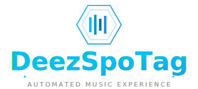
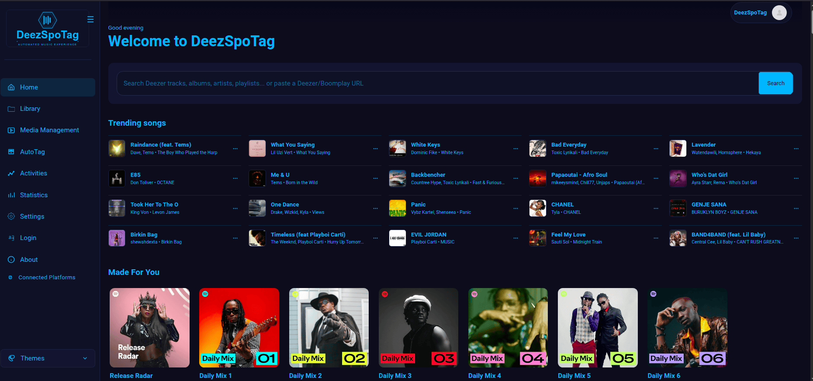

<p align="center">
  
</p>

# DeezSpoTag

Bridge streaming sources and local libraries with one web app. DeezSpoTag handles discovery, queueing, downloading, tagging, conversion, and organization workflows for self-hosted music stacks.

Support: [GitHub Issues](https://github.com/Lauqnan14/DeezSpoTag/issues)

---

## What It Does

DeezSpoTag automates music workflows end-to-end:

1. Collects tracks/albums/playlists from supported platforms.
2. Queues downloads with quality and fallback rules.
3. Processes files with multi-platform tagging, artwork and lyrics enrichment, Essentia tagging, quality upgrades, and multi-quality queueing (both stereo + Atmos for the same track), with video download support.
4. Supports conversion/transcoding flows where configured.
5. Organizes output into your library structure.
6. Allows manual tagging and lyrics editing
7. Sync artist's avatar, background art and background information from Spotify to your preferred media server
8. Recognize music using the intergrated Shazam by tapping on the logo 

---

<p align="center">
  
</p>

## ⚠️ Warning

- This project is under active development.
- Some features are experimental and may modify music metadata.
- Do not run this on your main library without a backup.
- Only Shazam, Spotify, iTunes, and Deezer have been thoroughly tested for tagging with reliable results.
- Manual tagging is still under heavy development.
- Soundtrack fetching requires a lot of work to reliably fetch soundtracks.

## Key Features

### Multi-Source Download Workflow

- Unified queueing across supported providers.
- Fallback logic for source/quality failures.
- Download path + library path separation.
- Multiple library support
- Multi-folder support for different content types.
- Browse discography from your library into Spotify discography and Apple Music Atmos tracks.

### Metadata, Tagging, and File Handling

- Multi-platform tagging controls.
- Built-in manual lyrics editor and lyrics creator.
- Essentia-based tagging support.
- Animated artwork support.
- Naming templates and folder structure customization.
- Optional post-download conversion controls.
- Multi-lyrics (.ttml and .lrc) support.
  
### Recommendations and Automation

- Daily music recommendations based on the music in your library.
- Automated playlist generation based on listening patterns.

---

## Login Requirements

Use the `Login` page to configure platform credentials.

### Deezer

- `ARL Login`: paste your Deezer `arl` cookie value.

### Spotify

- `Web Player Cookies`:
  - `sp_dc` is required.
  - `sp_dc` is the only Spotify web-player cookie DeezSpoTag asks you to save.
  - `User Agent` is optional (browser user agent is used if blank).
- `Spotify Connect / Blob Login`:
  - `Account Name` is required, and can be anything.
  - `Region` is optional.

  - Open the Spotify login page.
  - In Save Web Player Cookies, paste sp_dc.
  - Leave User Agent blank unless you have a specific reason to override it.
  - Click Save Web Player Cookies.
  - Wait for the success message.
  - Then go to Spotify Account Credentials.
  - Enter the account name you want to use.
  - Optionally set region.
  - Click Login.
  - Open Spotify desktop app or Spotify web player.
  - Transfer playback to the DeezSpoTag device in Spotify Connect.
  - Wait for the blob/librespot login to complete.

### Apple Music (Active subscription is a must)

- `Wrapper Login`:
  - Apple email and password are required.
  - 2FA code is required only when prompted.
- `Token Settings`:
  - `Storefront` (for example `us`) can be set.
  - `media-user-token` cookie value can be set.
  - `media-user-token` is required for AAC-LC downloads and Apple lyrics workflows.

### Discogs

- `Token` is required.

### Last.fm

- `API Key` is required.
- `Username` is optional.

### BPM Supreme

- UI collects `Email`, `Password`, and `Library` (`Supreme` or `Latino`).

### Plex

- `Server URL` and `Token` are required.

### Jellyfin

- `Server URL`, `API Key`, and `Username` are required.

Provider-specific features run only when that provider has valid credentials configured.

---

## Run With Docker Compose

Compose-only install is the primary deployment mode.

```bash
mkdir deezspotag && cd deezspotag
curl -L -o docker-compose.yml https://raw.githubusercontent.com/Lauqnan14/DeezSpoTag/main/src/docker-compose.yml
curl -L -o .env https://raw.githubusercontent.com/Lauqnan14/DeezSpoTag/main/src/.env.example
```

Create the host folders that will be mounted into the containers. These paths
match the compose defaults; use your own absolute paths on a NAS or server and
set the matching values in `.env`.

```bash
mkdir -p \
  ./data \
  ./apple-wrapper/data \
  ./apple-wrapper/session \
  ./downloads \
  ./library
```

Then configure `.env` and start:

```bash
docker compose up -d
```

Open:

- `http://<your-server-ip>:8668`

If your host uses Compose v1, replace `docker compose` with `docker-compose`.

---


### Common `.env` Values

- `DEEZSPOTAG_DATA_PATH` - app database, settings, logs, and persistent state
- `DEEZSPOTAG_DATA_PROTECTION_KEYS_DIR` (for multi-instance deployments, this must point to the same shared directory in every app instance)
- `APPLE_WRAPPER_DATA_PATH` - shared Apple wrapper control files
- `APPLE_WRAPPER_SESSION_PATH` - Apple wrapper login/session cache
- `DEEZSPOTAG_APPLE_WRAPPER_CONTROL_MODE` (`shared` recommended)
- `DOWNLOADS_PATH` - completed downloads
- `LIBRARY_PATH` - existing media library root


## Security Notes

- Host networking reduces network isolation between containers and the host.
- Keep the stack behind a reverse proxy and HTTPS when exposed externally.
- Restrict external access by network policy, IP rules, and/or upstream auth.
- Use strong credentials and rotate tokens regularly.

## Acknowledgements

DeezSpoTag was informed by ideas, architecture patterns, and implementation approaches from many open-source projects. Thanks to the creators and maintainers behind these projects:

- **deemix** (GPL-3.0) by Bambanah and contributors.
- **Lidarr** (GPL-3.0) by Team Lidarr.
- **MusicMover** (GPL) and contributors.
- **ShazamIO** (MIT) by dotX12.
- **SoulSync** (MIT-style license text) and contributors.
- **SpotiFLAC** (MIT) by afkarxyz, zarzet, and contributors.
- **hifi-api** (MIT) by sachin senal.
- **Wolframe Spotify Canvas** (MIT) by the Wolframe Team.
- **boomplay-main** (MIT) by Okoya Usman.
- **idonthavespotify** (MIT) by Juan Rodriguez Donado.
- **apmyx** and contributors.
- **lidify** (GPL-3.0) and contributors.
- **lrclib** (MIT) by tranxuanthang and contributors.
- **OneTagger** (GPL-3.0) and contributors.
- **MusicBrainz Picard** (GPL-2.0-or-later) by the MetaBrainz community.
- **puddletag** (GPL) and contributors.
- **qobuz-artist-discography** (MIT/ISC components) by Paweł Januszek and contributors.
- **refreezer** (GPL-3.0) and contributors.
- **spotizerr-phoenix** (GPL-3.0) and contributors.
- **ATL.NET** (MIT) by Zeugma440.
- **Cinemagoria** by Iván Luna and contributors.
- **Meloday** and its maintainer community.
- **WhatsMyBitrate** by oren-cohen and contributors.
- **syrics-web** (MIT) by Akash R. Chandran.
- **wrapper** by WorldObservationLog.
- **Apple Music API / tooling references** including work by Myp3a and Sendy McSenderson.

If any project listed above needs correction or more specific attribution, open an issue and it will be updated.

---

## Disclaimer

DeezSpoTag is provided for educational, research, and private-use purposes only.
The author does not condone or encourage copyright infringement or unauthorized distribution of protected content.

DeezSpoTag is an independent third-party project and is not affiliated with, endorsed by, or sponsored by Deezer, Spotify, Apple Music, TIDAL, Qobuz, Amazon Music, or any other platform referenced by this software.

By using this project, you are solely responsible for:

- Ensuring your use complies with applicable local, national, and international laws.
- Reviewing and following the Terms of Service of all connected platforms.
- Obtaining any permissions or rights required for the content you access or process.
- Any legal or account-related consequences resulting from misuse.

This software is provided "as is", without warranties of any kind, express or implied.
The author assumes no liability for account bans, data loss, damages, or legal claims arising from use of this project.
